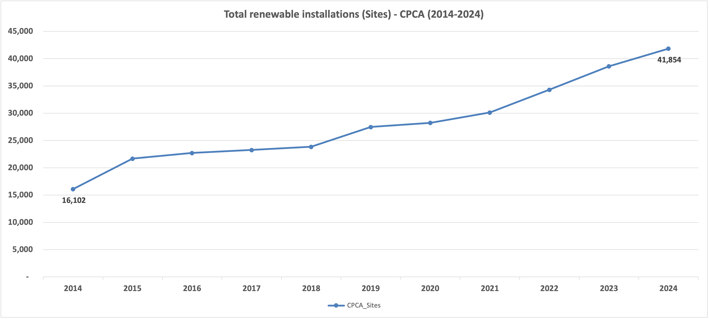
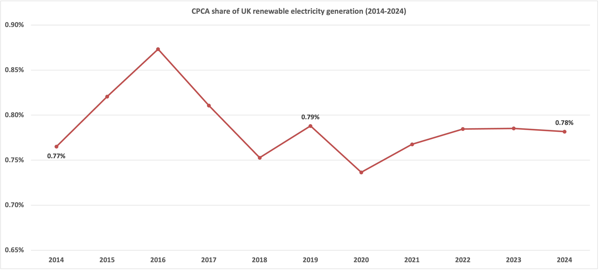

# CPCA Renewable Energy Installations & Generation Analysis (2014–2024)

## Overview

This project provides an initial scoping and benchmark analysis of renewable electricity activity across Cambridgeshire & Peterborough Combined Authority (CPCA) local authorities.

The analysis evaluates installation growth, generation output trends, and CPCA’s contribution to total UK renewable electricity generation over the period 2014–2024.

This is an initial scoping and benchmark analysis designed to support stakeholder discussion, with a defined roadmap for deeper investigation.

---

## Objectives

- Assess distribution of renewable installations across CPCA local authorities (2024)
- Quantify total installation growth (2014–2024)
- Benchmark CPCA renewable electricity generation against UK totals
- Calculate CPCA’s share of national renewable generation
- Identify strategic areas for deeper analytical expansion

---

## Scope

CPCA local authorities analysed:

- Cambridge  
- East Cambridgeshire  
- Fenland  
- Huntingdonshire  
- Peterborough  
- South Cambridgeshire  

**Note:** Installation counts represent number of renewable sites and do not directly indicate generation capacity.

---

## Data Source

- DESNZ Regional Renewable Statistics (GOV.UK)
- Local Authority Renewable Electricity Tables (2014–2024)

Contains public sector information licensed under the Open Government Licence v3.0.

---

## Methodology

- Filtered renewable installations and generation data to CPCA local authorities
- Aggregated annual totals (2014–2024)
- Benchmarked CPCA generation against UK totals
- Calculated CPCA percentage share of UK renewable generation
- Analysed growth trajectory and distribution patterns

---

## Key Findings

### 1️⃣ Installation Growth

Total renewable installations increased by **159.9%** between 2014 and 2024  
(**16,102 → 41,854 sites**).

Growth accelerated notably from 2019 onwards.

---

### 2️⃣ Uneven Local Distribution (2024)

Installations are concentrated in:

- South Cambridgeshire (11,879)
- Peterborough (11,462)

Lower counts observed in Cambridge, Fenland and East Cambridgeshire.

This highlights uneven spatial adoption across the region.

---

### 3️⃣ CPCA Share of UK Renewable Generation

CPCA renewable generation share remained broadly stable between **~0.75% and 0.87%** across the decade.

In 2024:

- CPCA Generation: 1,754,992  
- UK Generation: 224,497,189  
- CPCA Share: **0.78%**

Despite strong installation growth, proportional national contribution has remained stable.

---

## Visual Outputs

### CPCA Installation Growth (2014–2024)

---

### CPCA Share of UK Renewable Generation

---

## Strategic Considerations

The findings suggest:

- Strong regional growth in renewable site installations
- Stable proportional contribution to UK renewable generation
- Need to analyse installed capacity (MW) and technology mix to better explain generation dynamics
- Opportunity to normalise outputs (per household / per km²) for deeper benchmarking

---

## Continuous Improvement Roadmap

Future iterations should incorporate:

- Capacity (MW) benchmarking  
- Technology-type breakdown (solar, wind, biomass, etc.)  
- Output normalisation metrics  
- Infrastructure and grid constraint analysis  
- Cross-regional comparison beyond CPCA  

---

## Full Report & Dashboard

Board-ready presentation available:

[View Presentation (PDF)](Reports/CPCA_Renewable_Energy_Analysis.pdf)

Optional analytical dashboard (if uploaded):

[Download Excel Dashboard](Reports/CPCA_Renewable_Dashboard.png)

---

## Technical Approach

- Excel data cleaning and transformation  
- Year-on-year aggregation  
- Benchmark comparison modelling  
- Share-of-total percentage calculations  

---

## Repository Structure

- `/data` – Source dataset  
- `/Images` – Key visualisations  
- `/Reports` – Presentation and dashboard files  
